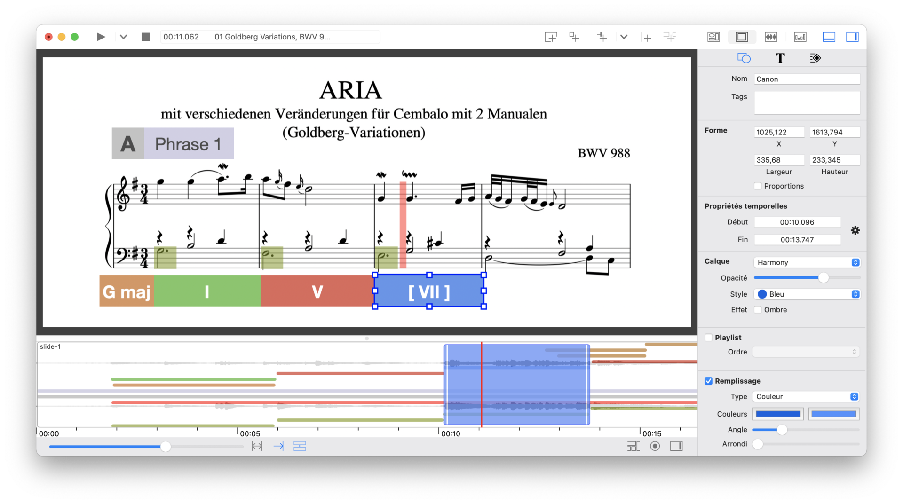
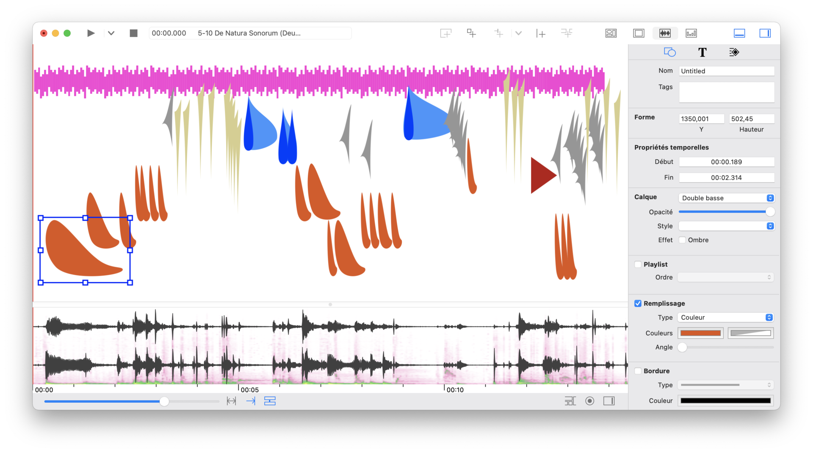

## iAnalyse 5

### Create beautiful musical analyses and listening guides

Minimum System Requirement: macOS 10.13.6 or newer

Languages: English, Français

[https://apps.apple.com/us/app/id1513428589](Download_on_the_Mac_App_Store_Badge_US-UK_blk_092917-300x76.png)

App Store Download : [https://apps.apple.com/us/app/id1513428589](https://apps.apple.com/us/app/id1513428589)

## Interface

* Create projects from zero or use a template library.
* 3 interfaces : 
	* The slideshow to synchronize the pages of a score on an audio or video file.
	* The time view to create representations from the audio signal, the FFT, audio descriptors, etc.
	* The animated view to view the audio parameters in a dynamic way. 
* Create representation of musical form and structure in a linear, formal diagram or arc diagram.
* Adding a cursor on the score to facilitate musical reading and playback.
* Support of all recent macOS features such as dark mode, importing FLAC and HEIC files, etc.

## Media

* Import different media formats (see below for a complete list).
* Use multitrack audio files.
* Change the playback tempo and transpose audio files.
* Extract audio descriptors: RMS amplitude, fundamental frequency estimation, peak frequency, spectral centroid, spectral crest, spectral decrease, spectral flatness, spectral rolloff, spectral standard deviation, spectral variance, zero crossing rate, mfcc.

## Representations

* Create different types of sound spectrum: linear, logarithmic, differential, chromagram.
* Create self-similarity matrices from FFT or any data.

## Annotations

* Add dynamic annotations on scores, images and representations (sound spectrum, self-similarity matrix, etc.).
* Use 14 types of annotations: rectangle, ellipse, text, frame with text, table, line, polygon, bezier curve, drawing, image, video, musical chords, cycle and pitch clock, tonnetz.
* Build in/out animation for annotations.

## Import formats

* Audio : aif, wav, mp3, m4a, flac (10.14+).
* Video: mov, mp4, m4v.
* Image: jpg, png, tiff, pdf, heic (10.14+).
* Data: txt, csv, xml.
* Others: MIDI, MusicXML, PRAAT pitch contour, Tony pitch track data, Reaper EDL, Pro Tools information session.

## Export

* Image: jpg, tiff, png, heic (10.14+).
* Video: h.264/AAC or HEVC/AAC
* Data: txt, xml, json.

## Old binaries:

* iAnalyse 4 for macOS 10.7 to 10.12: [https://github.com/pierrecouprie/ianalyse/releases/tag/4.3.0](https://github.com/pierrecouprie/ianalyse/releases/tag/4.3.0)
* iAnalyse 3 for macOS 10.5 or 10.6: [https://github.com/pierrecouprie/ianalyse/releases/tag/3.6.0](https://github.com/pierrecouprie/ianalyse/releases/tag/3.6.0)
